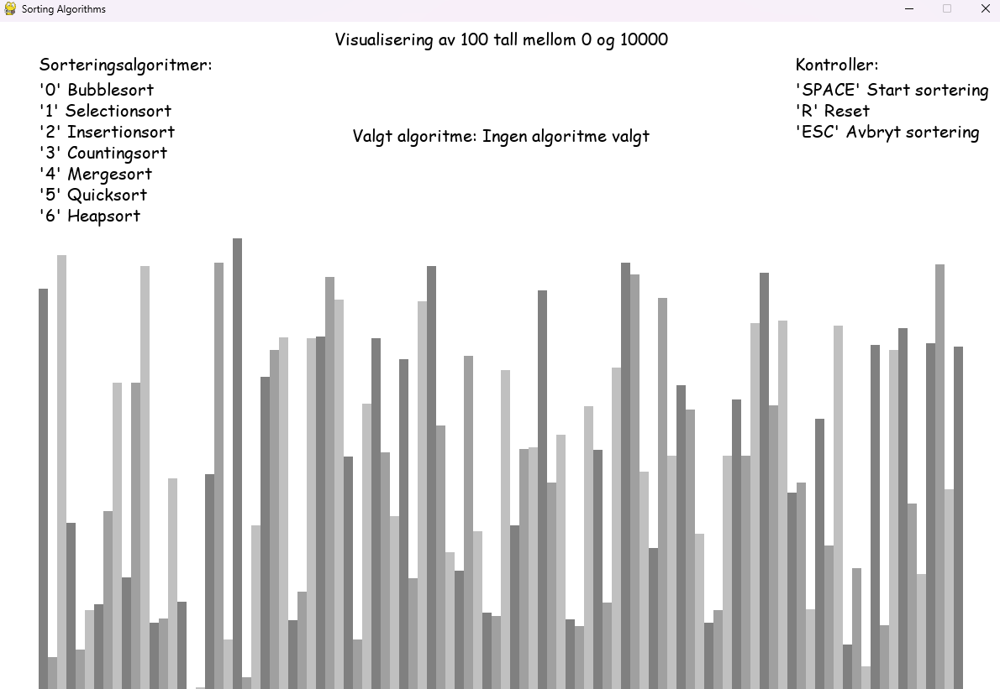

# Sorteringsalgoritmer Visualisering

## Innholdsfortegnelse
- [Beskrivelse](#beskrivelse)
- [Funksjoner](#funksjoner)
- [Hvordan bruke programmet](#hvordan-bruke-programmet)
- [Installasjon](#installasjon)
- [Skjermbilder](#skjermbilder)


## Beskrivelse

Programmet viser en grafisk fremstilling av hvordan forskjellige sorteringsalgoritmer fungerer i sanntid. Det genererer en liste med tilfeldige tall mellom 0 og 10000, og viser hvordan disse tallene sorteres ved hjelp av den valgte algoritmen. Greit å merke seg at programmet kjører i 60 fps, så tidsforbruk vil ikke stemme. Dette er mer for å vise hva som faktisk skjer nå man bruker en valgt algoritme.

## Funksjoner

* Visualisering av 7 forskjellige sorteringsalgoritmer:
  * Bubblesort
  * Selectionsort
  * Insertionsort
  * Countingsort
  * Mergesort
  * Quicksort
  * Heapsort
* Måling av tidsforbruk for hver algoritme
* Mulighet til å generere nye tilfeldige lister

## Hvordan bruke programmet

1. Start programmet ved å kjøre `python main.py`
2. Velg sorteringsalgoritme ved å trykke på talltastene 0-6:
   * 0: Bubblesort
   * 1: Selectionsort
   * 2: Insertionsort
   * 3: Countingsort
   * 4: Mergesort
   * 5: Quicksort
   * 6: Heapsort
3. Trykk på SPACE for å starte sorteringen
4. Trykk på R for å generere en ny tilfeldig liste
5. Trykk på ESC for å avbryte sorteringen
6. Lukk programmet ved å klikke på X i hjørnet

## Installasjon

1. Sørg for at du har Python installert
2. Installer Pygame ved å kjøre:
   ```
   pip install pygame
   ```
3. Last ned prosjektfilene
4. Kjør programmet med:
   ```
   python main.py
   ```

## Skjermbilder

### Visualisering av 1000 tall


### Visualisering av 100 tall


### Ferdig sortert

